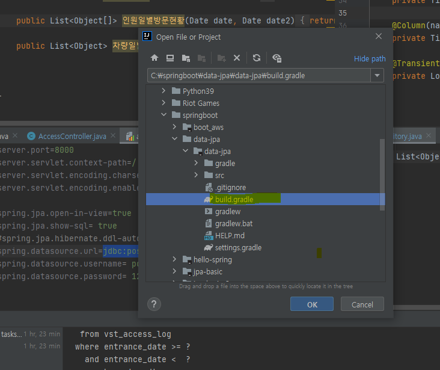
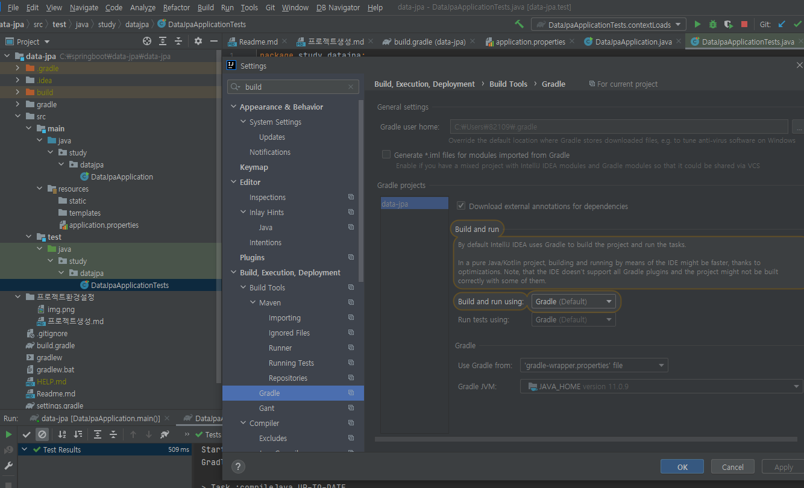
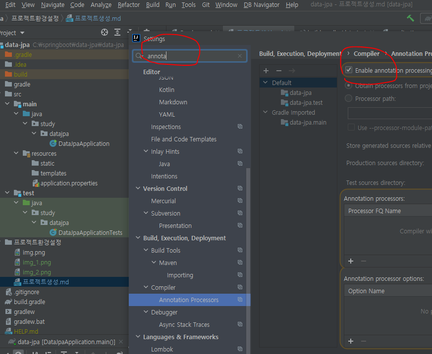

## 프로젝트 생성

https://start.spring.io/

에서 프로젝트 설정 후 다운로드 !!

=>
다운로드 한 파일 압축 풀기

open project => build.gradle 클릭

### 속도 개선 셋팅

file => settings

build 검색

다 intelliJ로 변경

### lombok 설정 셋팅

Annotation Processors 

체크하기

